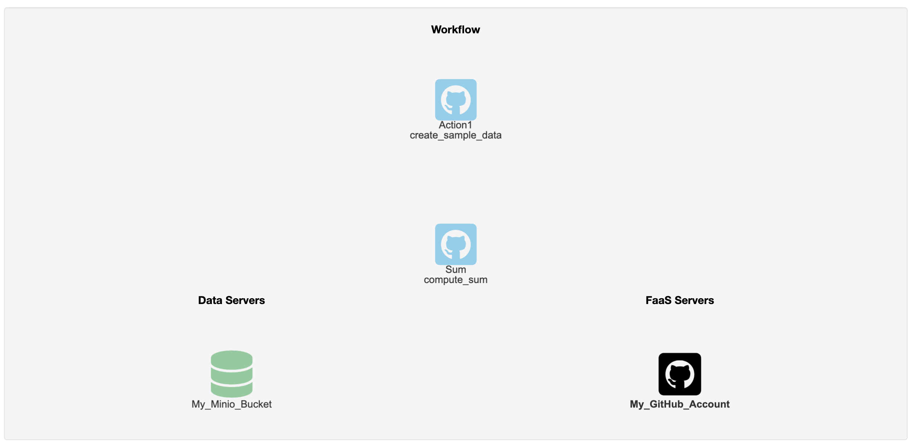
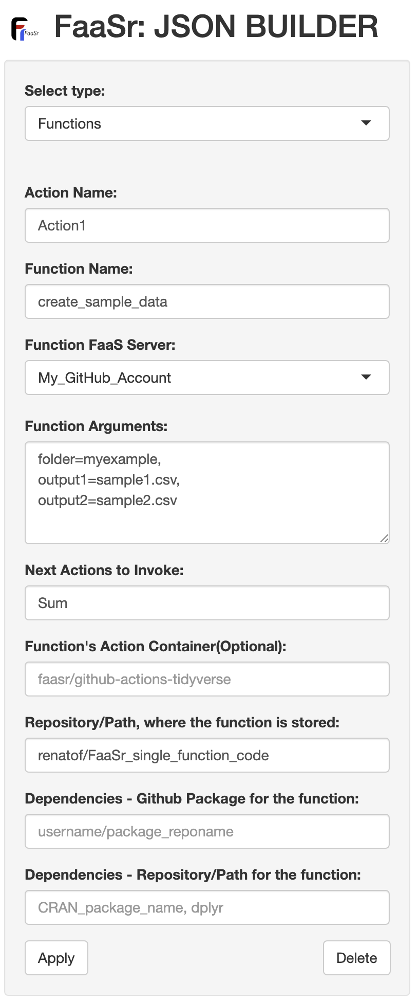
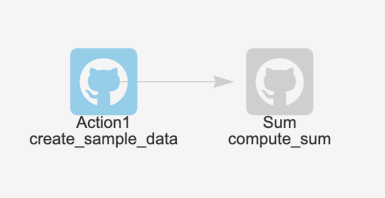

```{r, echo = FALSE, message = FALSE}
knitr::opts_chunk$set(collapse = T, comment = "#>")
options(tibble.print_min = 4L, tibble.print_max = 4L)
library(FaaSr)
set.seed(1014)
```

## Overview

This example guides you through the setup and execution of a simple FaaSr workflow with two functions. You will learn how to describe, configure, and execute a FaaSr function using GitHub Actions for cloud execution of functions, and a public Minio S3 “bucket” for cloud data storage. 
With the knowledge gained from this tutorial, you will be able to also run FaaSr workflows in OpenWhisk and Amazon Lambda, as well as use an S3-compliant bucket of your choice.

## Requirements

This vignette builds on the [companion vignette for single function](singlefunction.html) and assumes you have completed it successfully. 


## Add new R function to your repo

Use the GitHub web site to create a new repository, named `FaaSr_single_function_code` This is where your R source code will go.

Create a file `compute_sum.R` file in the `FaaSr_single_function_code` repository you created in the [companion vignette for single function](singlefunction.html), copying and pasting the code below. 
This function reads the CSV files created by `create_sample_date.R`, computes their sum, and uploads the output to an S3 bucket:

```{}
compute_sum <- function(folder, input1, input2, output) {
  # Download two input files from bucket, generate a sum of their contents, and write back to bucket
  # The function uses the default S3 bucket name, configured in the FaaSr JSON 
  # folder: name of the folder where the inputs and outputs reside
  # input1, input2: names of the input files
  # output: name of the output file
  
  faasr_get_file(remote_folder=folder, remote_file=input1, local_file="input1.csv")
  faasr_get_file(remote_folder=folder, remote_file=input2, local_file="input2.csv")
  
  # This demo function computes output <- input1 + input2 and stores the output back into S3
  # First, read the local inputs, compute the sum, and store the output locally

  frame_input1 <- read.table("input1.csv", sep=",", header=T)
  frame_input2 <- read.table("input2.csv", sep=",", header=T)
  frame_output <- frame_input1 + frame_input2
  write.table(frame_output, file="output.csv", sep=",", row.names=F, col.names=T)

  # Now, upload the output file to the S3 bucket and log a message

  faasr_put_file(local_file="output.csv", remote_folder=folder, remote_file=output)
  log_msg <- paste0('Function compute_sum finished; output written to ', folder, '/', output, ' in default S3 bucket')
  faasr_log(log_msg)
}	
```

## Add new function to workflow

You will again use the [FaaSr-JSON-Builder Shiny app](https://faasr.shinyapps.io/faasr-json-builder/) to update your workflow and generate a JSON configuration file.

1. Upload the `payload.json` file you downloaded when you completed [companion vignette for single function](singlefunction.html)
2. From the drop-down menu on the left, select `Functions`
3. Under `Action Name`, enter `Sum` - this is the name that will be used for your GitHub Action
4. Under `Function Name`, enter `compute_sum` - this is the name of the R function you created in the previous section.
5. Under `Function FaaS Server`, leave the default `My_GitHub_Account` - this is the name of the server you configured in the previous step.
6. Under `Function Arguments`, enter the following arguments, which will be passed to the `compute_sum()` function:

```{}
folder="myexample",
input1="sample1.csv",
input2="sample2.csv",
output="sum.csv"
```

7. Under `Next Actions to Invoke`, leave it blank (the default). This function is the last in the workflow graph and does not invoke any other functions.
8. Under `Function's Action Container`, leave it blank (the default). This example will use the default Rocker/Tidyverse FaaSr container.
9. Under `Repository/Path, where the function is stored`, enter your GitHub username and repository you created in a previous step, e.g. `username/FaaSr_single_function_code`
10. Leave the remaining fields as the default, and click the Apply button. You will see an icon for this function in the main window to the right.

{width=50%}

### Define the Workflow

As of this point, you have two actions defined - `Action1` and `Sum` - but they do not form a workflow graph yet:

{width=80%}

The workflow we want is one where `Action1` triggers the execution of `Sum` after it completes running. 
To express this, you need to edit `Action1` by double-clicking its icon on the main window. This allows you to edit its configuration on the left panel.
The only modification you need to make is:

1. Under `Next Actions to Invoke`, type `Sum` 
2. Leave the remaining fields as the default, and click the Apply button. 

{width=50%}

You will see now an arrow going from `Action1` to `Sum` in the main window to the right, representing the trigger issued by the former:

{width=50%}


### Generate, download and save the configuration file

Click on the `Download` button on the upper right. The file will be downloaded with the name `payload.json` in your computer. Move that to your Rstudio working directory.

## Register and run your new FaaSr workflow

Follow the steps described in the [companion vignette for single function](singlefunction.html) to register and invoke your workflow:

`faasr_example_new <- faasr(json_path="payload.json", env="faasr_env")`

`faasr_example_new$register_workflow()`

`faasr_example_new$invoke_workflow()`

## Check your outputs

Once the GitHub Action finishes, you should see a new file named `sum.csv` in the `faasr` bucket in Minio Play, under the `myexample` folder configured in a previous section:

`mc_ls("play/faasr/myexample")`


