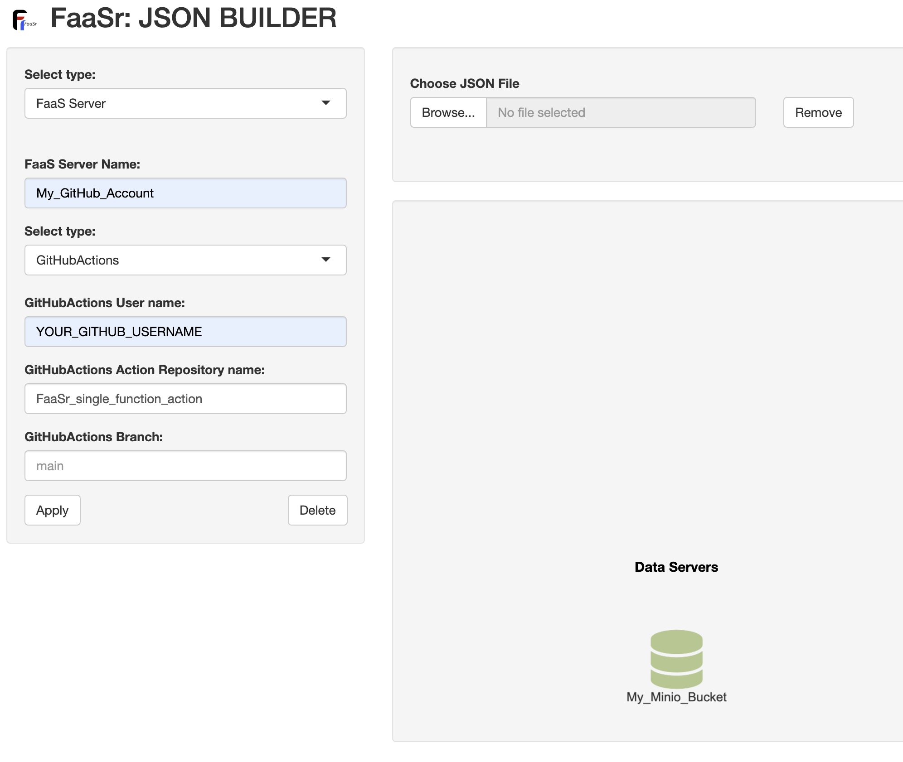
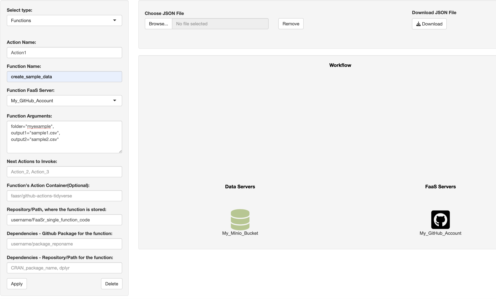

```{r, echo = FALSE, message = FALSE}
knitr::opts_chunk$set(collapse = T, comment = "#>")
options(tibble.print_min = 4L, tibble.print_max = 4L)
library(FaaSr)
set.seed(1014)
```

## Overview

This example guides you through the setup and execution of a simple FaaSr function. You will learn how to describe, configure, and execute a FaaSr function using GitHub Actions for cloud execution of functions, and a public Minio S3 “bucket” for cloud data storage. 
With the knowledge gained from this tutorial, you will be able to also run FaaSr workflows in OpenWhisk and Amazon Lambda, as well as use an S3-compliant bucket of your choice.

## Requirements

The main requirements to follow this vignette are: 
* FaaSr installed in RStudio in your desktop
* Git installed in your computer
* minioclient installed in your desktop (optional, but recommended - you can also use other S3 clients)
* A GitHub account 

For FaaSr to use your GitHub account, you need a GitHub personal access token (PAT), configured to enable at least the “workflow” and “read:org” (under admin:org) scopes.
With your GitHub PAT in hand, you can configure Rstudio and FaaSr to use it:

### Configure your Rstudio environment with your credentials

Ensure your Rstudio session can access GitHub account using your PAT so FaaSr can register and invoke functions on your behalf.

Replace YOUR_GITHUB_USERNAME and YOUR_GITHUB_EMAIL with your account information in the command below:

`usethis::use_git_config(user.name = "YOUR_GITHUB_USERNAME", user.email = "YOUR_GITHUB_EMAIL")`

This function will prompt you for your GitHub PAT token; copy and paste it to the pop-up window:

`credentials::set_github_pat()`

*note: make sure your git installation is set to use `main` as the default branch.* 
This is typically the default in most modern systems, but if your git version uses `master` as the default, you can change with this terminal command:
`git config --global init.defaultBranch main`

### Add your credentials to faasr_env file

You also need to add your GitHub and S3 credentials to a faasr_env file. 
Create a new faasr_env file with the following information, replacing with your GitHub PAT token, and save it to your current working directory.
The S3 credentials below are pre-set to use the Minio Play server.

```{}
"My_GitHub_Account_TOKEN"="REPLACE_WITH_YOUR_GITHUB_TOKEN"
"My_Minio_Bucket_ACCESS_KEY"="Q3AM3UQ867SPQQA43P2F"
"My_Minio_Bucket_SECRET_KEY"="zuf+tfteSlswRu7BJ86wekitnifILbZam1KYY3TG"
```

## Create GitHub repo and R function

Use the GitHub web site to create a new repository, named `FaaSr_single_function_code` This is where your R source code will go.

Create a file `create_sample_data.R` file in this repository, copying and pasting the code below. 
This function creates two synthetic .csv files and uploads to an S3 bucket:

```{}
create_sample_data <- function(folder, output1, output2) {

  # Create sample files for FaaSr example and stores in an S3 bucket
  #
  # The function uses the default S3 bucket name, configured in the FaaSr JSON
  # folder: name of the folder where the sample data is to be stored
  # output1, output2: names of the sample files to be created 
 
  df1 <- NULL
  for (e in 1:10)
    rbind(df1,data.frame(v1=e,v2=e^2,v3=e^3)) -> df1
  df2 <- NULL
  for (e in 1:10)
    rbind(df2,data.frame(v1=e,v2=2*e,v3=3*e)) -> df2

  # Now we export these data frames to CSV files df1.csv and df2.csv stored in a local directory
  #
  write.table(df1, file="df1.csv", sep=",", row.names=F, col.names=T)
  write.table(df2, file="df2.csv", sep=",", row.names=F, col.names=T)
  
  # Now, upload the these file to the S3 bucket with folder name and file name provided by user
  #
  faasr_put_file(local_file="df1.csv", remote_folder=folder, remote_file=output1)
  faasr_put_file(local_file="df2.csv", remote_folder=folder, remote_file=output2)

  # Print a log message
  # 
  log_msg <- paste0('Function create_sample_data finished; outputs written to folder ', folder, ' in default S3 bucket')
  faasr_log(log_msg)
}	
```

## Create JSON configuration file

You will use the [FaaSr-JSON-Builder Shiny app](https://faasr.shinyapps.io/faasr-json-builder/) to create your JSON configuration file.

### Define a Data Server

1. From the drop-down menu on the left, select `Data Server`.
2. For `Data Server Name`, enter `My_Minio_Bucket` - this is the name your S3 server will be referred to for any upload/download operations.
3. For `Data Server endpoint`, enter `https://play.min.io` - this is the Internet address of the S3 server.
4. For `Data Server Bucket`, enter `faasr`
5. Leave the remaining fields as the default, and click the Apply button. You will see an icon for this data server in the main window to the right.

{width=50%}

### Define a FaaS Server

1. From the drop-down menu on the left, select `FaaS Server`.
2. For `FaaS Server Name`, enter `My_GitHub_Account` - this is the name your FaaS server will be referred to for any functions that are executed.
3. For the `Select Type` drop-down, select `GitHubActions`.
4. For `GitHubActions user name`, enter your GitHub `username`. This will ensure FaaSr runs under your account.
5. For `GitHubActions Action Repository name`, enter `FaaSr_single_function_action` - this is where GitHub Actions will be configured by FaaSr.
6. For `GitHubActions Branch`, enter `main`
6. Leave the remaining fields as the default, and click the Apply button. You will see an icon for this FaaS server in the main window to the right.

{width=80%}

### Define the Workflow


1. From the drop-down menu on the left, select `Functions`.
2. Under `Action Name`, enter `Action1` - this is the name that will be used for your GitHub Action.
3. Under `Function Name`, enter `create_sample_data` - this is the name of the R function you created in the previous section.
4. Under `Function FaaS Server`, leave the default `My_GitHub_Account` - this is the name of the server you configured in the previous step.
5. Under `Function Arguments`, enter the following arguments, which will be passed to the `create_sample_data()` function:

```{}
folder="myexample",
output1="sample1.csv",
output2="sample2.csv"
```

6. Under `Next Actions to Invoke`, leave it blank (the default). This single function  does not invoke any other functions.
7. Under `Function's Action Container`, leave it blank (the default). This example will use the default Rocker/Tidyverse FaaSr container.
8. Under `Repository/Path, where the function is stored`, enter your GitHub username and repository you created in a previous step, e.g. `username/FaaSr_single_function_code`
9. Leave the remaining fields as the default, and click the Apply button. You will see an icon for this function in the main window to the right.

{width=90%}


### Configure starting function and log server

1. From the drop-down menu on the left, select `General Configuration`.
2. For the `First Function to be executed` drop-down, select `Action1`. This is the first (and only) function in this workflow graph.
3. For the `Logging Data Server` drop-down, select `My_Minio_Bucket`. This defines the S3 server where logs will be directed to with the `faasr_log()` functions in the R code above.
4. For the `Default Data Server` drop down, also  select `My_Minio_Bucket`. This defines the S3 server where files are stored/retrieved from with the `faasr_put_file()` and `faasr_get_file()` functions in the R code above.
5. Leave the remaining fields as the default, and click the Apply button.

{width=90%}

### Generate, download and save the configuration file

Click on the `Download` button on the upper right. The file will be downloaded with the name `payload.json` in your computer. Move that to your Rstudio working directory.

## Register your FaaSr workflow

Use the `faasr()` main function to load the `payload.json` configuration you just downloaded and the `faasr_env` credential file you created in a previous section:

`faasr_example <- faasr(json_path="payload.json", env="faasr_env")`

Now use `register_workflow()` to register your workflow with GitHub Actions. 
This automatically creates and configures a GitHub repository named `FaaSr_single_function_action` (see configuration step in previous section) on your behalf.
You can select if this is a public or private repository when interactively prompted:

`faasr_example$register_workflow()`

## Create S3 bucket

You can use minioclient, or another S3 client of your choice, to create the `faasr` bucket on Minio Play Server. 
With minioclient, the command to create a bucket is `mc_mb()`:

`mc_mb("play/faasr/")`

## Run your FaaSr workflow

Now use `invoke_workflow()` function to invoke (i.e. run) your workflow with GitHub Actions.:

`faasr_example$invoke_workflow()`

## Check your outputs

Once the GitHub Action finishes, you should see two files named `sample1.csv` and `sample2.csv` in the `faasr` bucket in Minio Play, under the `myexample` folder configured in a previous section:

`mc_ls("play/faasr/myexample")`


